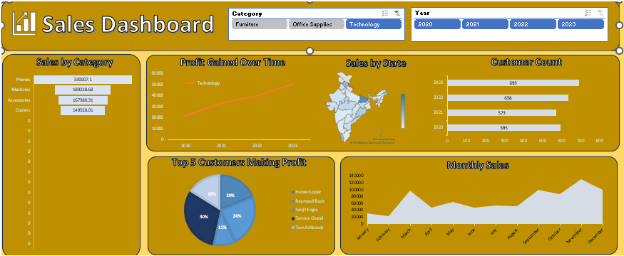

# 📊 Advanced Excel Sales Dashboard

## 📷 Dashboard Preview

### 📊 Main Dashboard



## 🎥 Video Demo

👉 [Watch Dashboard Demo on YouTube](https://youtu.be/M9cwmW33S8c?si=K6XbhtkJXwIp9v0k)

## 🚀 Overview

The **Advanced Excel Sales Dashboard** is a comprehensive business analytics solution built in **Microsoft Excel** to transform raw sales data into meaningful insights. Designed for decision-makers, analysts, and business professionals, the dashboard provides an interactive and visually engaging platform for monitoring key performance indicators (KPIs), analyzing revenue trends, evaluating product performance, and identifying growth opportunities.

By leveraging advanced Excel functionalities, this project enables users to gain a clear understanding of business performance and make data-driven decisions with confidence.

---

## 🎯 Project Objectives

✅ Monitor overall sales performance through key metrics.

✅ Analyze revenue, profit, and order trends over time.

✅ Identify top-performing products, categories, and regions.

✅ Track business growth using interactive visualizations.

✅ Support strategic decision-making with actionable insights.

✅ Convert complex datasets into easy-to-understand reports.

---

## ✨ Key Features

### 📈 Interactive Dashboard

Dynamic filters and slicers allow users to explore data from multiple perspectives and instantly update visualizations.

### 🎯 KPI Monitoring

Track critical business metrics including sales, revenue, profit, orders, and growth rates in real time.

### 💰 Revenue & Profit Analysis

Gain insights into financial performance through trend analysis and profitability reporting.

### 🛍️ Product Performance Tracking

Evaluate product and category performance to identify best-selling and underperforming items.

### 🌍 Regional Sales Analysis

Compare sales performance across different regions and markets.

### 📊 Trend Visualization

Analyze monthly, quarterly, and yearly business trends through interactive charts and reports.

### 🎨 Professional Data Visualization

Present complex business data through clean, modern, and intuitive dashboard elements.

---

## 📌 Dashboard KPIs

* 💵 Total Revenue
* 🛒 Total Sales
* 📈 Total Profit
* 📊 Profit Margin (%)
* 📦 Total Orders
* 💳 Average Order Value (AOV)
* 🚀 Monthly Sales Growth
* 🏆 Top Performing Products
* 🌎 Best Performing Regions
* 📂 Category-Wise Performance

---

## 🛠️ Technologies & Tools Used

* 📗 Microsoft Excel
* 📊 Pivot Tables
* 📈 Pivot Charts
* 🎛️ Slicers & Timelines
* 🎨 Conditional Formatting
* ⚡ Advanced Excel Functions
* 🧹 Data Cleaning & Transformation
* 📉 Dashboard Design & Visualization Techniques

---

## 💼 Business Value

This dashboard helps organizations:

✔️ Monitor business performance effectively.

✔️ Discover sales trends and revenue patterns.

✔️ Improve operational decision-making.

✔️ Identify profitable products and regions.

✔️ Optimize sales strategies using data insights.

✔️ Enhance reporting efficiency through automation.

---

## 🔍 Insights Generated

The dashboard enables users to answer important business questions such as:

* Which products generate the highest revenue?
* Which regions contribute the most to sales?
* How has revenue changed over time?
* What is the overall profit margin?
* Which categories are driving business growth?
* What are the current sales trends and patterns?


## 📁 Project Structure

```text
Advanced-Excel-Sales-Dashboard/
│
├── Dashboard.xlsx
├── Dataset.xlsx
├── images/
│   └── dashboard-preview.png
└── README.md
```

---

## 🧠 Skills Demonstrated

* 📊 Data Analysis
* 📈 Data Visualization
* 💼 Business Intelligence
* 🎯 Dashboard Development
* 📋 KPI Reporting
* ⚡ Excel Automation
* 📉 Sales Analytics
* 🚀 Decision Support Reporting

---

## 🏅 Project Highlights

⭐ Interactive Sales Dashboard

⭐ Advanced KPI Tracking

⭐ Revenue & Profit Analysis

⭐ Dynamic Filters & Slicers

⭐ Business Performance Monitoring

⭐ Executive-Level Reporting

⭐ Data-Driven Decision Making

---

## 👨‍💻 Author

### Malkeet Singh

📚 B.Com Student

📊 Excel Analyst

📈 Data Analytics Enthusiast


## 🏷️ Tags

`Excel` `Sales Dashboard` `Data Analytics` `Business Intelligence` `Data Visualization` `KPI Dashboard` `Revenue Analysis` `Profit Analysis` `Pivot Table` `Pivot Chart` `Excel Project` `Dashboard Design` `Sales Analytics` `Reporting Dashboard` `Business Analytics`

---

### ⭐ If you found this project useful, consider giving it a Star on GitHub!
